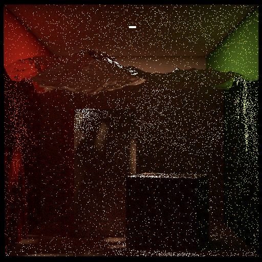
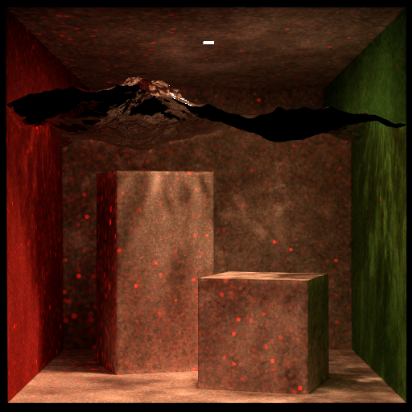

# CSE 168 Final Project: Photon mapping
Implementation of progressive photon mapping to better model caustics compared to path tracing and multiple importance sampling. Extension of the existing UCSD CSE168 ray tracing render projects Torrey. A pdf of the final report can be found in the docs folder or the direct markdown source can be viewed in mdbook.

Algorithm and implementation based on progressive photon mapping proposed by Toshiya et al.

**Importance sampling**\


**Progressive photon mapping**\


# torrey
UCSD CSE 168 renderer
https://cseweb.ucsd.edu/~tzli/cse168/

Project is an extension of the implemented homework assignments from
https://github.com/BachiLi/torrey_public

# Build
All the dependencies except for some scenes are included. Use CMake to build. First clone the repo, then run
```
mkdir build
cd build
cmake ..
```
It requires compilers that support C++17 (gcc version >= 8, clang version >= 7, Apple Clang version >= 11.0, MSVC version >= 19.14).

To use Helix editor and language server support on Rocky 9:
- Install `clang-tools-extra` for `clangd`
- Install `bear` for generating build commands
- `bear -- make` after `cmake ..` in `build`

# Scenes
You should also download the scenes we will use in later homeworks from the following Google drive link: 
[https://drive.google.com/file/d/1SrGaw6AbyfhPs1NAuRjxSEQmf34DPKhm/view?usp=sharing](https://drive.google.com/file/d/1SrGaw6AbyfhPs1NAuRjxSEQmf34DPKhm/view?usp=sharing).

The water meshes used for the cbox water scenes are from the Water Caustic scene https://benedikt-bitterli.me/resources/
# Run
Try 
```
cd build
./torrey -o output.exr ../scenes/cbox/cbox.xml -renderer mis
```
This will generate an image "cbox.exr" using Mulitple Importance sampling renderer.

As of now, the ppm renderer is hard coded to use max depth of 15, 2000000 photons, 64 visible points per pixel, 0.7 alpha, 20 passes, and default radius of 20. To change these values change the parameters in the function call `ppm` which is in render.cpp

PPM also only supports dielectrics, diffuse, and mirrors.

To view the image, use [hdrview](https://github.com/wkjarosz/hdrview), or [tev](https://github.com/Tom94/tev).

## CLI args
As of now the arg parsing is a little bit wonky, if it crashes on parse then the order is probably wrong or there is a typo or missing arg or a bug we didn't catch yet...

```
usage:
    -o [outfile name] [scene file] -renderer [renderer type]
  __________________________________________________________
    [outfile name] | the name of output file
    [scene file] | path to mitsuba xml(not all features fully supported)
    [renderer type] | nee,path,mis,ppm
        nee | next event estimation
        path | path trace
        mis | multiple importance sample
        ppm | progressive photon map

optional args:
    -t [num]  | number of threads
    -max_depth [num] | max depth to path trace
```

# Acknowledgement
Code is extension of the Torrey repo for UCSD CSE 168 homework assignments that is linked above

Toshiya et al. Paper: (http://graphics.ucsd.edu/~henrik/papers/progressive_photon_mapping/progressive_photon_mapping.pdf)

Also referred to PBR book section on stochastic progressive photon mapping as it has a small section about ppm.
https://www.pbr-book.org/3ed-2018/Light_Transport_III_Bidirectional_Methods/Stochastic_Progressive_Photon_Mapping#

The renderer is heavily inspired by [pbrt](https://pbr-book.org/), [mitsuba](http://www.mitsuba-renderer.org/index_old.html), [the ray tracing series](https://raytracing.github.io/), and [darts](https://cs87-dartmouth.github.io/Fall2022/darts-overview.html).

We use [pugixml](https://pugixml.org/) to parse XML files.

We use [stb_image](https://github.com/nothings/stb) and [tinyexr](https://github.com/syoyo/tinyexr) for reading & writing images.

We use [miniz](https://github.com/richgel999/miniz) for compression & decompression.

We use [tinyply](https://github.com/ddiakopoulos/tinyply) for parsing PLY files.]

We use [nanoflann](https://github.com/jlblancoc/nanoflann) for a k-d tree library

Many scenes in the scenes folder are downloaded from:
- [http://www.mitsuba-renderer.org/download.html](http://www.mitsuba-renderer.org/download.html)
- [https://benedikt-bitterli.me/resources/](https://benedikt-bitterli.me/resources/)
- [https://casual-effects.com/data/](https://casual-effects.com/data/)
