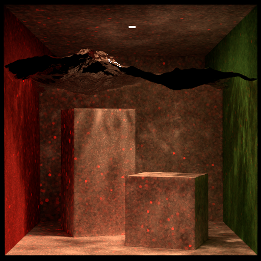

# CSE 168 Final Project Report - Photon Mapping

## Photon Mapping and Progressive Photon Mapping

Earlier in the class we have implemented Monte Carlo ray tracing to solve the rendering equation
without approximations. The advantage of this method is that it is unbiased in that addition of
multiple ray traced results will converge towards the final image and no systematic bias would be
noticed. However, it has great trouble with scenes where the light is small due to the much smaller
probability of sampling lights through the scene after bouncing through specular to diffuse to
specular materials. This is most obvious when rendering caustics:

Photon Mapping is a method of modeling light particles to render an image. It works by shooting
light rays and depositing photons on hit surfaces in the scene. Then the scene can be integrated
with brightness interpreted from counting photon densities on the surface. During Photon Mapping,
rays are traced both from the camera and from the lights and connected in the middle through the
deposited photons. This solves the aforementioned problem of low probability. However, Photon
Mapping is memory intensive as it requires a massive tree of coordinates with one for each photon.
Also, although consistent, it can be biased, especially when photon count and the number of batches
are low.

Progressive Photon Mapping is a method developed by Hachisuka et al. which is better optimized for
computing restraints by first tracing rays to find relevant “visible points” in the scene before
shooting light particles and iteratively accumulating them on the visible points then discarding
them. This method allows many more photons to be used by shooting them in batches which keeps the
memory footprint as low as the size of photons shot in an iteration. Since it converges after an
infinite number of batches, arbitrary accuracy can be achieved with finite memory.

## General Design, Algorithm Overview

The progressive photon mapping algorithm is done in 6 steps corresponding to the algorithm in the
Toshiya paper:

1. Trace visible points
2. Dispense photons into scene
3. Gather photons around each visible points
4. Adjust radii of visible points for nearby photons
5. Add flux contribution of nearby photons to the visible points
6. After repeating steps 2-5 many times, render image using visible point accumulated flux to
   estimate radiance

### Code Organization

The project is an extension of Ryan’s C++ homework assignments based on Torrey. The main program
selects a renderer which is implemented as a function in renderer.cpp. To divide and organize code,
Implementation of the rendering algorithms and related functions are located in respective cpp
files. Common functionalities for structs and data such as light, importance sampling, shapes, and
ray intersections are separate files. We used the existing cache aligned BVH with compaction, SIMD,
and surface area heuristic from the homework implementation. For a k-d tree we used the nanoflann
open source header implementation.

### Implementation

Here is a Detailed narratives of implementing each of the steps form algorithm overview:

1. Trace visible points

To store the visible points we defined a vector of vectors as a 3D array to store visible point
structs. The struct contains information about a specific visible point such as position, normal,
incoming direction, emission, decay level of iterations (beta), material, photon radius, count, and
accumulated flux (tau).

The tracing itself is done in a parallel loop with the final image divided into tiles where threads
trace visible points for a tile. This division nicely works since each tile is independently
modifying visible points and we don’t need to worry about thread safety.

Finding visible points is simply sampling a ray for a pixel in the final image, then tracing that
ray using path tracing and multiplying by the BRDF each bounce until it hits a diffuse surface.

2. Dispense photons into scene

To dispense photons first a light is chosen with uniform probability. Then the light is sampled.
To sample a point light we sample a direction using uniform sphere sampling. To sample from area
lights, we importance sample a point on the light then sample a direction from the cosine hemisphere
at that point. The flux of the sampled photon can be calculated by normalizing these samples.

\\[
\text{flux point} = \frac{I}{p(\text{choose light})*p(\text{direction from light})}
\\]

\\[
\text{flux area} = \text{direction} \cdot \text{light norm} \cdot \text{flux point}
\\]

Then we iteratively trace the path of the photon into the scene depositing the photon’s flux at the
intersection with the scene, calculate bounce and modify the flux by the BRDF of the intersection,
then repeat. To terminate the path we use Russian Roulette with a method derived from the PBR book.
It uses the delta in the Y term in the flux of the photon to determine when to stop. The natural
eyes respond more to green colors which is why Y is used.  Or we thought so -- turns out that's the
source of the random blobs in our results.  The correct explanation is that Y refers to the Y in XYZ
color space, which represents the brightness.  Images of the bug are shown below.

Each photon is traced serially since the current data structure used is not thread safe. This is one
of the possible future improvements.

3. Gather photons around each visible point

Photons deposited in step 2 are stored in a k-d tree. We can query the tree to find the number of
neighbors in a sphere in parallel for each visible point’s location.

4. Adjust radii for visible points

After querying the count of photons in parallel, we can adjust the radius of visible point using the
equation from the paper

\\[
R' = R \cdot \sqrt{\frac{n + \alpha m}{n + m}}
\\]

5. Add flux contribution of nearby photons to the visible points

The flux and incident angle for each photon is stored in a hashmap keyed by the photon’s location.
For each new photon in the radius we can calculate its contribution by

\\[
\tau_m = \frac{\text{if mat is diffuse} \cdot \text{photon flux} \cdot \text{vp color} \cdot \text{cosine}}{\pi}
\\]

Then the new accumulated flux is calculated by adjusting the sum of contributions using the formula
from the paper:

\\[
\tau' = \left(\tau + \tau_m\right) \frac{n + \alpha * m}{n + m}
\\]

6. After repeating steps 2-5 many times, render image using visible point accumulated flux to
   estimate radiance

Rendering is done in parallel where each pixel is calculated as the sum of radiance for its visible
points using the formula from the paper:

\\[
\text{color_vp}_i = \text{emission} + \frac{\tau}{r^2 n\_{emitted} \pi}
\\]

\\[
\text{color} = \frac{\sum_i \text{color_vp}_i}{\text{num passes}}
\\]

## Results

### cbox

cbox with multiple importance sampling, 512 spp:

Same cbox scene with PPM 200k photons, 15 iterations:

Both scenes took around 20 seconds to render, however using multiple importance sampling the result
is much less noisy.  When not trying to render caustics, it seems to work better to just use other
integration methods.

### Water

Multiple importance sampling, 512 spp:

PPM with 200,000 photons, and 55 iterations:

These images both took around 2 minutes to render, in the one with MIS you are barely able to tell
what the scene is, and with PPM it shows interesting patterns and is much more clear, but still has
some splotchiness.

### Different photon and iteration count visualized in cbox

#### cbox

200,000 photons, 20 passes:

The same splotchiness still exist here.

200,000 photons, 100 passes:

2,000,000 photons, 20 passes:

As photon count or number of passes are increased, the splotchiness gets a lot better.

#### cbox with spheres

200,000 photons, 20 passes:

200,000 photons, 100 passes:

2,000,000 photons, 20 passes:

As photon count or number of passes are increased, the splotchiness also gets a lot better in this
scene.  It appears that we really need a higher number of photons since it improves the result the
most.

### Water with point light

2,000,000 photons, 20 passes:

Our PPM renderer allows us to visualize well the kind of caustics even with a point light, where our
MIS renderer would have completely choked on.  Same goes for the small light:

## Bugs we fixed

### Missing parentheses in Russian Roulette calculation

Before:

After:

### Mistaking the Y from XYZ as the G from RGB

Before:

After:

Before:

After:

## Future steps and possible extensions

- Parallelized photon dispersion
- Work on the memory footprint; to generate the higher quality images it still needed many SPP and
  lots of photons which ended up using 10s of GBs of memory
- Automatic hyperparameter searching
- Combination with other integration methods:  There are pixels which are totally black in some
  of the result images such as the one with a glass ball or the water image.  Combining the direct
  lighting with ppm should give these pixels some color.
- Stochastic progressive photon mapping and other bidirectional light transport type algorithms can
  be combined for more noise free renders
