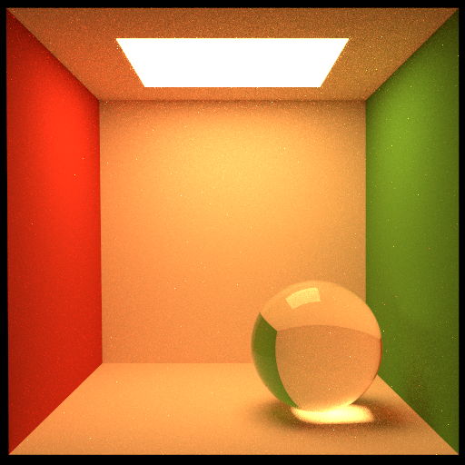
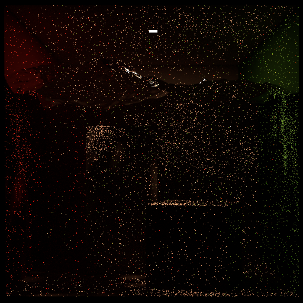
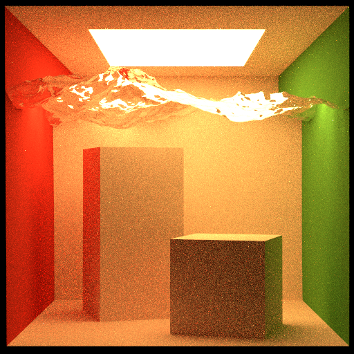

# Progress report: June 5th

We are trying to implement progressive photon mapping to better render dielectrics and model
caustics with global illumination. Caustics create natural and beautiful patterns but are unable
to be easily rendered using standard global illumination path tracing since the patterns are most
easily observed with small light sources passing through glass which is not modeled well due to zero
probability of path traced rays going through the glass and successfully hitting a light source.

## What We have currently

The current starting point of the project is the accumulation of work done on the homework
assignments.

- Path tracing for global illumination
- Diffuse, mirror, Phong, Blinn-Phong, Blinn-Phong microfacet BRDFs for materials
- One sample multiple importance sampling
- Anti-aliasing
- Compacted bounding volume heirarchies built with some surface area heuristic with some SIMD and
  using iterative stack based methods and some SIMD

## What we have done so far

- Fix bugs in path tracing and multiple importance sampling
- Refactor code for readability
	- Add more files to split up code and also split rendering by strategies
- Implement MIS dielectrics
- Create a few scenes to help demonstrate caustics, render them
- Reading and start figuring out photon mapping algorithm and structures needed
- Read the [original paper](
  http://graphics.ucsd.edu/~henrik/papers/progressive_photon_mapping/progressive_photon_mapping.pdf)
  for photon mapping
- Set up beefy x86_64 rendering machine
- Research KD-tree libraries (nanoflann)

## Initial results

Here are some images we have rendered using the base renderer from the homework:

Dielectric, Single Sample Multiple Importance Sampling, 512x512, 512 SPP:

Water caustic with area light, Single Sample Multiple Importance Sampling, 512x512, 10000 SPP:

Water casutic with area light, Single Sample Multiple Importance Sampling, 512x512, 512 SPP:

Water casutic with large area light, Single Sample Multiple Importance Sampling, 512x512, 512 SPP:

The water with large light renders pretty good with MIS already.  However when the area light is
small it is very noisy and the image is not very clear even with 10000 samples per pixel.

## What we need to still do

- Integrate nanoflann (a header-only KD-tree library)
	- Figure out how to build the tree in parallel
	- Flesh out threading model
- Transforming `Vector3` and other Torrey defined types to fit into nanoflann
- Working with the parallel support provided by both libraries
- More materials
	- Start implementation with diffuse, mirror, and dielectric (e.g. glass) materials first
	- Other BRDFs like Phong, Blinn-Phong, and Blinn-Phong microfacet BRDFs
- Lighting, start with point lights, then go on to area lights
- Implement the phases of the photon mapping algorithm
	1. Tracing rays and getting "visible points"
	2. Disperse photons into the scene, store these in our KD-tree
	3. Update the progressive radiance estimates
	4. Evaluate radiance
- Make some more scenes to display caustic effects
	- Find scenes/objects: we need to find or make some scenes and objects with glass that are good
	  at showing the effects of caustics and improvements using photon mapping versus the standard
	  path tracing methods

## Additional improvements we'd like to implement if time permits

- Better optimized BVH with SIMD
- BVH multithreading construction
- Improve the surface area heuristic implementation
- Implement iterative path tracing instead of recursive path tracing
- If there is a lot of time, maybe even implementing combination of irradiance caching and photon
  mapping

## Resources

[PBR chapter on photon mapping](
https://www.pbr-book.org/3ed-2018/Light_Transport_III_Bidirectional_Methods/Stochastic_Progressive_Photon_Mapping)
